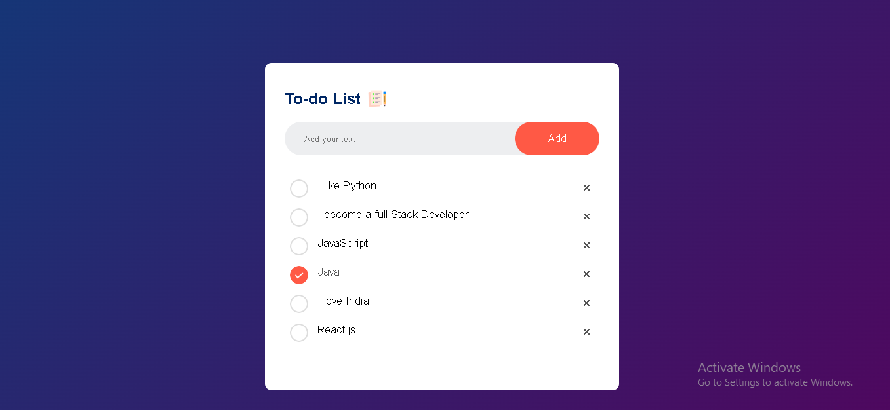
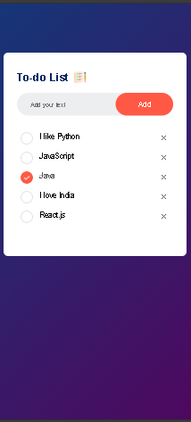

# ✅ To-Do List App

A simple, responsive, and interactive **To-Do List App** built using **HTML, CSS, and JavaScript**. This project helps users manage daily tasks efficiently by allowing them to add, complete, and delete tasks. Tasks are also saved using Local Storage, so they remain available even after refreshing the page.

---

## 📸 Screenshots

### 💻 Desktop View



### 📱 Mobile View



---

## 🚀 Live Demo

🔗 **Live Demo:** https://your-live-demo-link

---

## 💻 Source Code

🔗 **GitHub Repository:** https://github.com/your-username/todo-list-app

---

## ✨ Features

- ➕ Add New Tasks
- ✅ Mark Tasks as Completed
- ❌ Delete Tasks
- 💾 Local Storage Support
- 📱 Responsive Design
- 🎨 Clean and Modern UI
- ⚡ Fast and Lightweight

---

## 🛠️ Built With

- HTML5
- CSS3
- JavaScript (ES6)
- Local Storage API

---

## 📂 Folder Structure

```
todo-list-app/
│
├── assets/
│
├── screenshots/
│   ├── desktop-view.png
│   └── mobile-view.png
│
├── index.html
├── style.css
├── script.js
└── README.md
```

---

## ⚙️ Installation

1. Clone the repository

```bash
git clone https://github.com/your-username/todo-list-app.git
```

2. Open the project folder.

3. Open **index.html** in your browser.

---

## 📖 How to Use

1. Enter a task.
2. Click the **Add** button.
3. Click a task to mark it as completed.
4. Click the delete icon to remove a task.
5. Refresh the page — your tasks remain saved.

---

## 🎯 Future Improvements

- Task Categories
- Dark Mode
- Due Date
- Search Tasks
- Edit Tasks
- Task Priority
- Drag & Drop Sorting

---

## 🤝 Contributing

Contributions are welcome!

Feel free to fork this repository and submit a pull request.

---

## 👨‍💻 Author

**Saif Farid**

GitHub: https://github.com/saiffarid-dev

LinkedIn: https://linkedin.com/saif-farid

---

## ⭐ Support

If you found this project helpful, please give it a ⭐ on GitHub.

---

## 📄 License

This project is licensed under the MIT License.